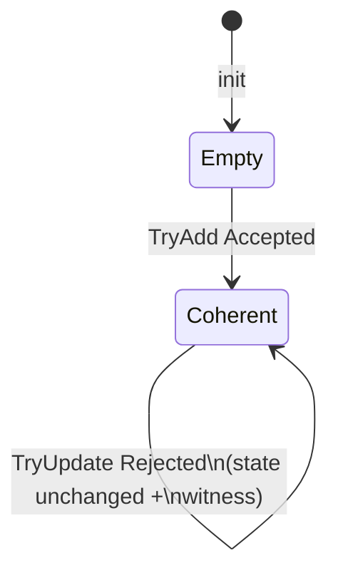

# ABAC Coherence Verifier — Full Specification (Draft v0.1)

Status: draft for group review. Source of truth after approval.
Intent (confirmed 2026-09-18): Dafny-core ABAC verifier, compiled to JS, shipped as npm package with TS wrappers; minimal management demo; paper deliverable.

## 1. Goal

Build a formally verified coherence checker for attribute-based access control (ABAC) rulesets.

- Input: versioned ruleset written in a small custom policy language.
- Output: machine-checked verdict — coherent, or rejected with a witness (concrete request + offending rule pair).
- Invariant (the thesis): **every reachable ruleset committed through the guarded API is coherent**. Proven in Dafny, executed as Dafny-compiled JS, distributed via npm.
- Demo: minimal ruleset management system exhibiting every verifier feature.
- Paper: language model, checks, results, model validation, one state-transition behavior + model check.

## 2. Scope / non-goals

In scope:

- Custom policy language: Permit/Deny rules over subject / resource / action / environment attributes with boolean combinators, equality, bounded-int comparisons.
- PIP-sourced attributes **as schema declarations only** (type + finite domain / int range). No live DB/clock/GPS calls inside the verifier.
- Checks: unsatisfiable rule, pairwise Permit/Deny overlap (contradiction), shadowed/subsumed rule (nullification), schema/type invalidity.
- Guarded evolution: `TryAdd / TryUpdate / TryRemove`; reject-on-violation with witness; `Evaluate` for single-request decisions.
- npm package: Dafny core → JS + TS wrappers + non-critical utils (parser, pretty-printer, schema helpers).
- Demo: CRUD ruleset, live verdict, counterexample display, request playground, current-version view.
- Paper artifacts: transition diagram, invariant proof, bounded model-check results, case studies.

Out of scope (explicit):

- Unbounded strings, regex, free-text PIP fields; real-valued / temporal logic beyond bounded-int windows.
- Conflict-resolution strategies (deny-overrides, first-applicable, priorities). Any Permit/Deny overlap **is** the error.
- Completeness/coverage obligation (ruleset may leave requests undecided → default Deny; no "must cover all requests" check in v1).
- Live PIP connectors, PEP enforcement, distributed PDP, persistence, auth, multi-tenancy.
- Version-history / rollback UI beyond current-version display (revisit only if time remains).
- Backwards compatibility shims or legacy policy importers (per repo rules: no unrequested legacy support).

## 3. Formal language model

### 3.1 Attribute schema (PIP contract)

Centralized constants (names; values fixed in `Schema.dfy` / `config`):

- `ATTR_FAMILIES = { Subject, Resource, Action, Environment }`
- Each attribute declaration: `(family, name, type, domain)` where type ∈ `{ Enum, Bool, BoundedInt }`.
- `Enum`: explicit finite value set, e.g. `role ∈ { medic, nurse, admin }`, `action ∈ { read, write }`.
- `BoundedInt`: closed interval `[ATTR_INT_MIN, ATTR_INT_MAX]` per attribute, e.g. `clearance ∈ [1, 5]`, `hour ∈ [0, 23]`. Global defaults `DEFAULT_INT_MIN / DEFAULT_INT_MAX` overridden per attribute.
- `Bool`: `{ true, false }`.
- Well-formedness: attribute names unique per family; every rule references declared attributes only, with type-correct literals.

v1 schema (initial; extensible by adding declarations, no grammar change):

| Family | Attribute | Type | Domain |
|---|---|---|---|
| Subject | role | Enum | medic, nurse, admin |
| Subject | dept | Enum | cardio, radio, er |
| Subject | clearance | BoundedInt | 1..5 |
| Resource | type | Enum | record, lab, prescription |
| Resource | sensitivity | BoundedInt | 1..5 |
| Action | name | Enum | read, write |
| Environment | hour | BoundedInt | 0..23 |
| Environment | emergency | Bool | true/false |

### 3.2 Syntax

```
Ruleset   ::= Rule*
Rule      ::= effect Target
effect    ::= Permit | Deny
Target    ::= predicate over one Request
Predicate ::= Atom | ! Predicate | Predicate && Predicate | Predicate || Predicate
Atom      ::= attrRef == literal | attrRef != literal
            | intAttr <|> | <= | >= | > intLiteral
            | boolAttr == boolLiteral
            | enumAttr == enumLiteral
Request   ::= total assignment of every declared attribute to an in-domain value
```

Notes:

- Negation + conjunction/disjunction are in the core (needed for overlap reasoning); parser may sugar `in {a,b}`, `between`, `!=` into the core.
- No arithmetic, no function calls, no cross-attribute comparisons (`a < b`) in v1. Only attribute-vs-literal. Rationale: keeps SMT decidable (QF_FD + LIA over bounded domains) and proofs tractable.
- Requests are total and in-domain by construction; out-of-domain inputs are rejected at the TS boundary, never reach Dafny.

### 3.3 Semantics (Dafny source of truth)

- `Satisfies(req, pred): bool` — structural recursion over predicate.
- `Applies(req, rule): bool` — `Satisfies(req, rule.target)`.
- `PermitSet(R) / DenySet(R)` — rules partitioned by effect.
- `Evaluate(ruleset, req): Decision` where `Decision ∈ { Permit, Deny }`:
  - exactly one side applies → that decision;
  - neither applies → `Deny` (closed-world default, documented in UI);
  - both apply → unreachable on coherent rulesets; on raw (unguarded) input returns `Conflict` internally but the guarded API never commits such a ruleset (see §5). `Evaluate` over a committed ruleset therefore never returns `Conflict`.
- All three functions live in `Eval.dfy` as pure `function`s (no I/O, no heap) so they compile cleanly to JS.

## 4. Coherence properties (the checks)

For ruleset `R`, with `req` ranging over all schema-valid requests (`AllRequests`, finite by construction):

- **P1 — Consistency (no contradiction).** `∀ req · ¬(∃ p ∈ PermitSet(R) · Applies(req,p)) ∨ ¬(∃ d ∈ DenySet(R) · Applies(req,d))`. Formally: no request satisfies both a Permit and a Deny rule.
- **P2 — Rule satisfiability (no vacuous/invalid rule).** `∀ r ∈ R · ∃ req · Applies(req,r)`. Each rule fires on at least one request. Covers unsatisfiable conditions (`clearance > 5 && clearance < 2`) and enum impossibilities.
- **P3 — Non-shadowing (no nullified rule).** `∀ r ∈ R · ∃ req · Applies(req,r) ∧ (∀ r' ∈ R, r' ≠ r · ¬Applies(req,r'))`. Each rule has at least one request it alone decides — strictly stronger than P2; P2-violation implies P3-violation, reported as unsatisfiable rather than shadowed. Same-effect subsumption (`r` covered by another Permit) and cross-effect masking both flag here; witness names the covering rule(s).
- **P4 — Schema validity.** Every rule type-checks against the schema: known attributes, literal in-domain, operator compatible with type. Decided in TS parser + mirrored as Dafny `ValidRule` predicate so proofs assume only valid input.

`Coherent(R) ≜ P1 ∧ P2 ∧ P3 ∧ P4.` Dafny `predicate Coherent(Ruleset): bool`. Each conjunct is independently queryable so the UI can report *which* property failed.

Redundancy nuance: exact-duplicate rules violate P3 (neither has a sole-witness request) and are reported as shadowed, not as a separate check — one mechanism, no duplicate diagnostics.

## 5. State transition system (the model-checked behavior)

Behavior under verification: **ruleset evolution through guarded admin operations**.

- **State:** `Ruleset` (ordered list of valid rules + schema reference). Initial state `EmptyRuleset` (vacuously coherent).
- **Transitions (total functions returning a result datatype):**
  - `TryAdd(R, r): AddResult = Accepted(R') | Rejected(witness)`
  - `TryRemove(R, id): Ruleset` (removal preserves coherence — lemma `RemovePreservesCoherent`)
  - `TryUpdate(R, id, r): same shape as TryAdd`
- **Guard:** `Accepted` iff `Coherent(R')`; else `Rejected` with `Witness = (request, ruleIds, failedProperty ∈ {P1,P2,P3,P4}, explanation)`. Failed commit leaves `R` unchanged (no partial application).
- **Inductive invariant:** `Coherent(R)` holds in every state reachable via `Accepted` transitions from `EmptyRuleset`. Proven: base lemma + preservation lemma per operation (`AddPreserves`, `UpdatePreserves`, `RemovePreserves`).
- **Diagram (for paper + docs):**



Model-checking story (§9) discharges the invariant two ways: Dafny inductive proof (unbounded) + bounded exhaustive enumeration over the v1 schema as an explicit finite-state check.

## 6. Dafny design

Modules (one file each, no cross-imports beyond listed deps):

- `Schema.dfy` — attribute declarations, domains, `ValidRequest`, `AllRequests` (bounded enumeration for model checking only), `ValidRule`.
- `Syntax.dfy` — `Effect`, `Predicate`, `Rule`, `Ruleset` datatypes.
- `Eval.dfy` — `Satisfies`, `Applies`, `Evaluate` (deps: Schema, Syntax).
- `Coherence.dfy` — `P1..P4` predicates, `Coherent`, witness datatypes, per-property `Check*` functions returning `Witness option` (deps: Eval).
- `Transition.dfy` — `TryAdd/TryRemove/TryUpdate`, preservation lemmas, `InductiveInvariant` lemma (deps: Coherence).
- `BoundedCheck.dfy` (ghost/test-only) — exhaustive enumerator over `AllRequests` for small schemas; used by proofs-as-tests and the bounded model-check export, excluded from JS build where it would blow up.

Proof obligations (each a named lemma, all must verify with `dafny verify`):

1. `EmptyCoherent`, 2. `AddPreserves`, 3. `RemovePreservesCoherent`, 4. `UpdatePreserves`, 5. `EvaluateAgreesOnCoherent` (Evaluate = Permit iff some Permit applies, on coherent inputs), 6. `WitnessSoundness` (every Rejected witness genuinely violates the named property), 7. `WitnessCompleteness` on bounded domains (every violation yields a witness — bounded scope stated in paper).

Assumptions (explicit axioms, listed in paper § Threats): schema domains finite and correct wrt real PIPs; requests total/in-domain at Dafny boundary (TS enforces); no cross-attribute comparisons.

Build: `dafny build --target:js` (or `py` fallback if JS backend gaps hit — decision logged). Only `Eval + Coherence + Transition` (non-ghost) compile into the npm payload.

## 7. npm package

- Name (provisional): `@grupo1/abac-verifier`. API (TS wrappers over Dafny-compiled JS):
  - `loadSchema(decls): Schema`
  - `parseRule(src, schema): Rule | ParseError`
  - `tryAdd(ruleset, rule): Accepted | Rejected(Witness)` (+ `tryUpdate`, `remove`)
  - `checkCoherent(ruleset): Report` (per-property breakdown)
  - `evaluate(ruleset, request): Permit | Deny + firingRuleIds`
  - `explain(witness): string` (human-readable, TS-side only)
- TS owns: parsing, schema loading, input sanitization (domain/range rejection), pretty-printing, error messages. Dafny owns: all `Satisfies / Applies / Coherent / Try*` decisions. TS never re-implements a Dafny decision (no logic duplication).
- Non-critical utils (TS-only, unproven, clearly marked): parser combinators, formatter, schema builder, fixture generators for tests.
- Packaging: `dafny/` sources + `src/` wrappers + `dist/` compiled output; `dafny verify` in CI gate; `npm test` runs wrapper tests + replay of Dafny counterexamples.

## 8. Minimal management system (demo)

Single-page minimal app (in-memory store, no auth, no backend beyond the npm package):

- Ruleset editor: list rules, add (text box + schema-aware lint), update, remove.
- Verdict bar: Coherent / Incoherent + per-property badges (P1–P4) after every keystroke (debounced `checkCoherent`).
- Reject dialog: on `Rejected`, show witness request as attribute table + offending rules + plain-language explanation ("Permit rule #2 and Deny rule #5 both fire when role=medic, …").
- Request playground: fill attribute values (dropdowns bounded by schema) → `evaluate` → Permit/Deny + firing rules.
- Seed fixtures: one-click load of `contradictory`, `shadowed`, `unsatisfiable`, `clean` rulesets (doubles as paper case studies).
- No persistence beyond localStorage; no user accounts; no history view in v1.

## 9. Validation, model checking, paper

- **Dafny verification:** full `dafny verify` clean; lemma list from §6 is the results table.
- **Bounded model check:** instantiate v1 schema (or a shrunk 2-role/2-resource/boolean-only sub-schema for tractability), enumerate `AllRequests × all rulesets up to MAX_RULES_SMALL (= 3)` and all `TryAdd` transitions; assert invariant + witness soundness/completeness. Report states explored, time, solver version. This is the "model check the transition diagram" deliverable, stated with its bound.
- **Case studies (paper § Evaluation):** the four fixtures above, each with before/after verdict + witness; one PIP-grounded scenario (emergency override: `emergency==true` Permit vs business-hours Deny) showing schema-bounded reasoning over PIP attributes.
- **Paper skeleton:** 1. Problem & ABAC background, 2. Language + formal semantics, 3. Coherence properties, 4. Transition system + diagram, 5. Dafny proofs, 6. Bounded model-check results, 7. Demo + npm design, 8. Limitations (bounds, no resolution strategies, closed-world default), 9. Related (XACML, Cedar, ALFA).
- **Test plan:** Dafny `expect` harnesses for lemmas on small instances; TS unit tests for parser/edge domains; fixture replay tests asserting exact witnesses (regression net for proof changes).

## 10. Risks / open decisions

- Dafny→JS backend fidelity (record/CLI flag gaps) — spike first; fallback target documented, never silent.
- SMT blowup if domains grow — hard caps `MAX_ENUM_VALUES (= 16)`, `MAX_RULES_CHECKED (= 64)` as named constants; beyond caps the API returns `TooLarge` (explicit error, never a fallback approximation).
- `Evaluate` both-sides-applies on raw input: internal `Conflict`, unreachable via guarded API; paper states the closed-world default and the unreachability lemma.
- Completeness (P3) cost: pairwise sole-witness search is O(|R|² · |Requests|); acceptable on bounded v1 schema, stated as bound.

## 11. Acceptance criteria

- `dafny verify` passes on all §6 lemmas; bounded check reproduces with logged state counts.
- npm `tryAdd` rejects all three bad fixtures with correct property + witness; accepts clean fixture; `evaluate` agrees with Dafny oracle on 100% of sampled requests.
- Demo flows (edit → verdict → witness → playground) work end-to-end against the compiled package.
- Paper draft covers model, checks, results, validation, diagram + model-check section.
